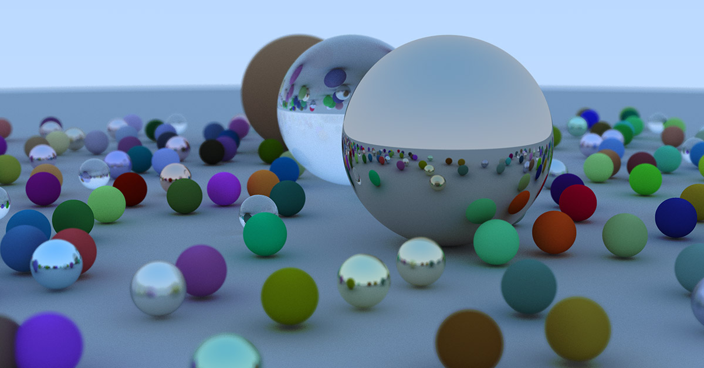

# Raytracing in One Weekend

A simple [Raytracer](https://ameliemaia.github.io/raytracing-in-one-weekend/) based on [Ray Tracing in One Weekend](https://raytracing.github.io/) by [Peter Shirley](https://twitter.com/Peter_shirley).

This is still a work in progress as I haven't completed the book yet :)

This WebApp is based on [WebGL React App](https://github.com/jam3/webgl-react-app) by [Jam3](https://www.jam3.com/).

License MIT
